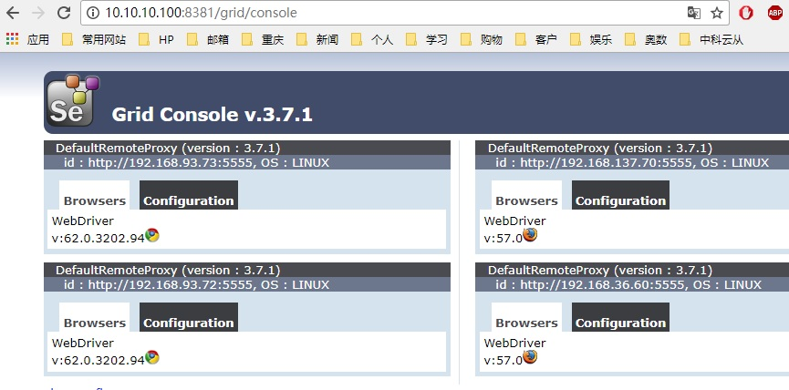

kuberneres  All to yaml file

## MYSQL主从
- __生成mysql主从环境__

```
[root@k8smaster1 kubernetes]# cd mysql/
[root@k8smaster1 mysql]# kubectl create -f .
configmap "mysql" created
service "mysql" created
service "mysql-read" created
statefulset "mysql" created
```
- __查看生成的mysql主从环境__

```
[root@k8smaster1 mysql]# kubectl get pods|grep mysql
mysql-0                                   2/2       Running   0          46s
mysql-1                                   2/2       Running   0          37s
mysql-2                                   2/2       Running   0          28s
```
- __测试mysql主从环境__

```
mysql> show master status;
+--------------------+----------+--------------+------------------+-------------------+
| File               | Position | Binlog_Do_DB | Binlog_Ignore_DB | Executed_Gtid_Set |
+--------------------+----------+--------------+------------------+-------------------+
| mysql-0-bin.000003 |      154 |              |                  |                   |
+--------------------+----------+--------------+------------------+-------------------+
1 row in set (0.00 sec)

mysql> show databases;
+------------------------+
| Database               |
+------------------------+
| information_schema     |
| mysql                  |
| performance_schema     |
| sys                    |
| xtrabackup_backupfiles |
+------------------------+
5 rows in set (0.01 sec)

mysql> create database test;
Query OK, 1 row affected (0.02 sec)

mysql> create database test1;
Query OK, 1 row affected (0.01 sec)

mysql> create database test2;
Query OK, 1 row affected (0.01 sec)

mysql> show databases;
+------------------------+
| Database               |
+------------------------+
| information_schema     |
| mysql                  |
| performance_schema     |
| sys                    |
| test                   |
| test1                  |
| test2                  |
| xtrabackup_backupfiles |
+------------------------+
8 rows in set (0.01 sec)

Oracle is a registered trademark of Oracle Corporation and/or its
affiliates. Other names may be trademarks of their respective
owners.

Type 'help;' or '\h' for help. Type '\c' to clear the current input statement.

mysql> show databases;
+------------------------+
| Database               |
+------------------------+
| information_schema     |
| mysql                  |
| performance_schema     |
| sys                    |
| test                   |
| test1                  |
| xtrabackup_backupfiles |
| zabbix                 |
+------------------------+
8 rows in set (0.01 sec)

mysql> create database test2;
Query OK, 1 row affected (0.01 sec)


mysql> show slave status \G;
*************************** 1. row ***************************
               Slave_IO_State: Waiting for master to send event
                  Master_Host: mysql-0.mysql
                  Master_User: root
                  Master_Port: 3306
                Connect_Retry: 10
              Master_Log_File: mysql-0-bin.000003
          Read_Master_Log_Pos: 154
               Relay_Log_File: mysql-1-relay-bin.000004
                Relay_Log_Pos: 371
        Relay_Master_Log_File: mysql-0-bin.000003
             Slave_IO_Running: Yes
            Slave_SQL_Running: Yes
              Replicate_Do_DB:
          Replicate_Ignore_DB:
           Replicate_Do_Table:
       Replicate_Ignore_Table:
      Replicate_Wild_Do_Table:
  Replicate_Wild_Ignore_Table:
                   Last_Errno: 0
                   Last_Error:
                 Skip_Counter: 0
          Exec_Master_Log_Pos: 154
              Relay_Log_Space: 3000812
              Until_Condition: None
               Until_Log_File:
                Until_Log_Pos: 0
           Master_SSL_Allowed: No
           Master_SSL_CA_File:
           Master_SSL_CA_Path:
              Master_SSL_Cert:
            Master_SSL_Cipher:
               Master_SSL_Key:
        Seconds_Behind_Master: 0
Master_SSL_Verify_Server_Cert: No
                Last_IO_Errno: 0
                Last_IO_Error:
               Last_SQL_Errno: 0
               Last_SQL_Error:
  Replicate_Ignore_Server_Ids:
             Master_Server_Id: 100
                  Master_UUID: 0fbc35e2-cf23-11e7-9f67-f25b91a6f1d4
             Master_Info_File: /var/lib/mysql/master.info
                    SQL_Delay: 0
          SQL_Remaining_Delay: NULL
      Slave_SQL_Running_State: Slave has read all relay log; waiting for more updates
           Master_Retry_Count: 86400
                  Master_Bind:
      Last_IO_Error_Timestamp:
     Last_SQL_Error_Timestamp:
               Master_SSL_Crl:
           Master_SSL_Crlpath:
           Retrieved_Gtid_Set:
            Executed_Gtid_Set:
                Auto_Position: 0
         Replicate_Rewrite_DB:
                 Channel_Name:
           Master_TLS_Version:
1 row in set (0.00 sec)

ERROR:
No query specified

mysql> show databases;
+------------------------+
| Database               |
+------------------------+
| information_schema     |
| mysql                  |
| performance_schema     |
| sys                    |
| xtrabackup_backupfiles |
+------------------------+
5 rows in set (0.04 sec)
```

- __解决主从不能复制__

```
change master to master_host='mysql-0.mysql',master_user='root',master_password='';
```

- __REDIS主从__

```
[root@k8smaster1 kubernetes]# cd redisha/
[root@k8smaster1 redisha]# ls
primary.yml  secondary.yml  sentinel.yml
[root@k8smaster1 redisha]# kubectl create -f .
service "redis-primary" created
statefulset "redis-primary" created
service "redis-secondary" created
statefulset "redis-secondary" created
service "redis-sentinel" created
statefulset "redis-sentinel" created

[root@k8smaster1 redisha]# kubectl exec -it redis-primary-0 /bin/sh
/data # redis-cli
127.0.0.1:6379> set a 1
OK
127.0.0.1:6379> exit
/data #


[root@k8smaster1 ~]#  kubectl exec -it redis-secondary-0  /bin/sh
/data # redis-cli
127.0.0.1:6379> get a
"1"
```

- __ZOOKEEPER集群__

```
[root@k8smaster1 zookeeper]# kubectl create -f zookeeper.yaml service "zk-svc" created
configmap "zk-cm" created
poddisruptionbudget "zk-pdb" created
statefulset "zk" created

[root@k8smaster1 zookeeper]# kubectl get pods|grep zk
zk-0                                      1/1       Running   0          4m
zk-1                                      1/1       Running   0          4m
zk-2                                      1/1       Running   1          3m
```
- __KAFKA集群__

```
[root@k8smaster1 zookeeper]# cd ../kafka/
[root@k8smaster1 kafka]# kubectl create -f kafka.yaml
service "kafka-svc" created
poddisruptionbudget "kafka-pdb" created
statefulset "kafka" created

[root@k8smaster1 kafka]# kubectl get pods|grep kafka
kafka-0                                   1/1       Running   0          12m
kafka-1                                   1/1       Running   0          11m
kafka-2                                   1/1       Running   0          11m
```
- __KAFKA集群测试__

```
[root@k8smaster1 kafka]# kubectl exec -ti kafka-0 -- bash
kafka@kafka-0:/$ kafka-topics.sh --create \
> --topic test \
> --zookeeper zk-0.zk-svc.default.svc.cluster.local:2181,zk-1.zk-svc.default.svc.cluster.local:2181,zk-2.zk-svc.default.svc.cluster.local:2181 \
> --partitions 3 \
> --replication-factor 2
Created topic "test".
kafka@kafka-0:/$ kafka-console-consumer.sh --topic test --bootstrap-server localhost:9093
hello
I like kafka
goodbye


[root@k8smaster1 ~]# kubectl exec -ti kafka-1 -- bash
kafka@kafka-1:/$
kafka@kafka-1:/$
kafka@kafka-1:/$ kafka-console-producer.sh --topic test --broker-list localhost:9093
hello
I like kafka
goodbye
```
- __SELENIUM GRID__

```
[root@k8smaster1 selenium]# kubectl create -f .
replicationcontroller "selenium-hub" created
service "selenium-hub" created
replicationcontroller "selenium-node-chrome" created
replicationcontroller "selenium-node-firefox" created

[root@k8smaster1 selenium]# kubectl get pods|grep selenium
selenium-hub-69wtl                        1/1       Running   0          24m
selenium-node-chrome-7frxv                1/1       Running   0          24m
selenium-node-chrome-d4jn5                1/1       Running   0          24m
selenium-node-firefox-1l5l4               1/1       Running   0          24m
selenium-node-firefox-wjcbz               1/1       Running   0          24m
[root@k8smaster1 selenium]# kubectl get svc|grep selenium
selenium-hub   10.254.155.12   <nodes>       4444:8381/TCP                    26m
```

- __访问SELENIUM GRID__

